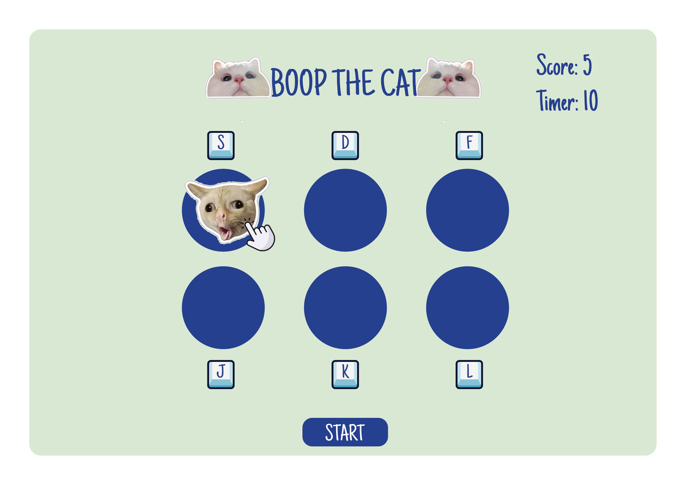
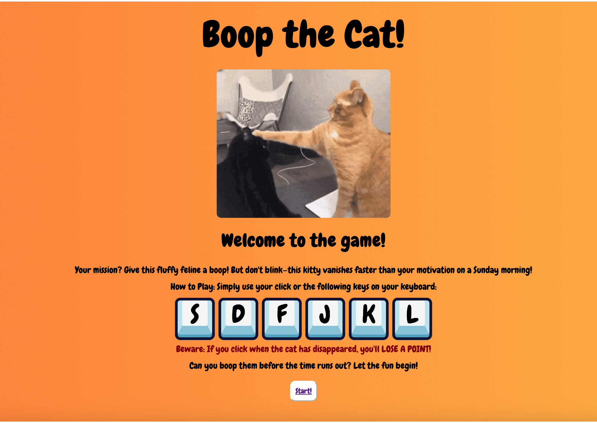
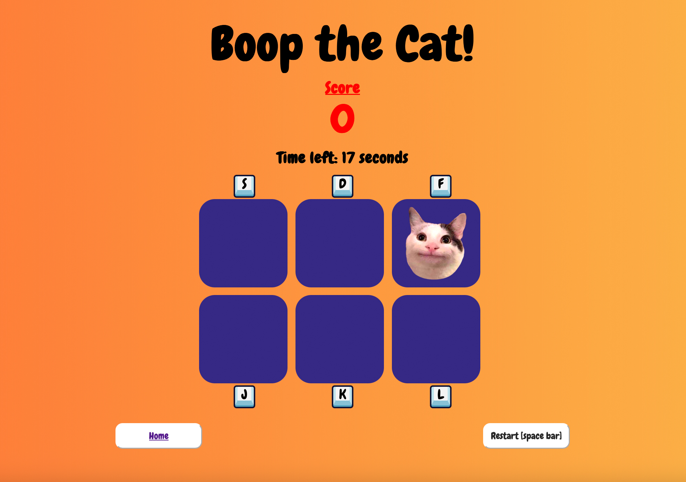

# Boop the Cat
## Date: 23/09/2025
### By: Zahid Balooshi
***

### *Description*
A simple Whack-a-Mole game but renamed to Boop-the-Cat – because we are not aggressive. Instead of whacking a mole, we’ll be booping a cat. The game will also have keyboard inputs for each “hole” for dynamic booping. The more you boop, the more points you earn – until the timer runs out!
***

### *How to Get Started*
Click “Start” button to begin. Boop the meow as they appear with either mouse clicks or keyboard buttons.

Link to game: https://boop-the-cat.surge.sh/
***
### *Concept Wireframe*

***
### *Pseudocode*
* The game will have a start button that will initiate the game.
* There will be a grid of 2 by 3, which will give us 6 "holes".
* We will have a function that will be showing the cat face in the holes between 0.5 and 1 seconds at random and then removing it. Then looping this function so it reassigns the cat to a different box and so on.
* There will eventListeners for mouse click as well as keyboard buttons (keyboard buttons will be assigned to specific grids and they won't change).
* There will be eventHandlers that will access the click/key event and perform function which will add to the score tally.
* There will timer counting down to zero. As soon as it hits zero, the game will end disabling grid clicks and showing cat functions.
* There will be a restart button as well as a home button.

***

### *Final Product*
Home Page:

Game Page:

***

### *Credits*

* https://www.w3schools.com
* https://developer.mozilla.org
* https://codepen.io

* Game Music: Mrthenoronha https://freesound.org/people/Mrthenoronha/
* scoreSound Credit: https://freesound.org
* missedSound Credit: UHOH.wav by xtrgamr -- https://freesound.org/s/259172/ -- License: Attribution 4.0
